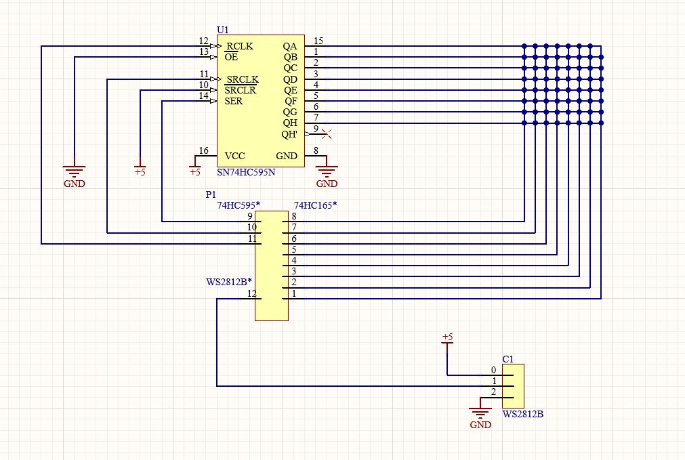

A chess project on arduino.

schematic ^

Ideally I would use a 74HC165 for the input pins, but I do not have one, so I will be using 8 arduino pins. 
This is still okay because the arduino has enough pins for me to do this.

The intersections will be metal contacts for the pieces.

Things left to do:
    Add castling, promotions and en passant
    Build the physical board